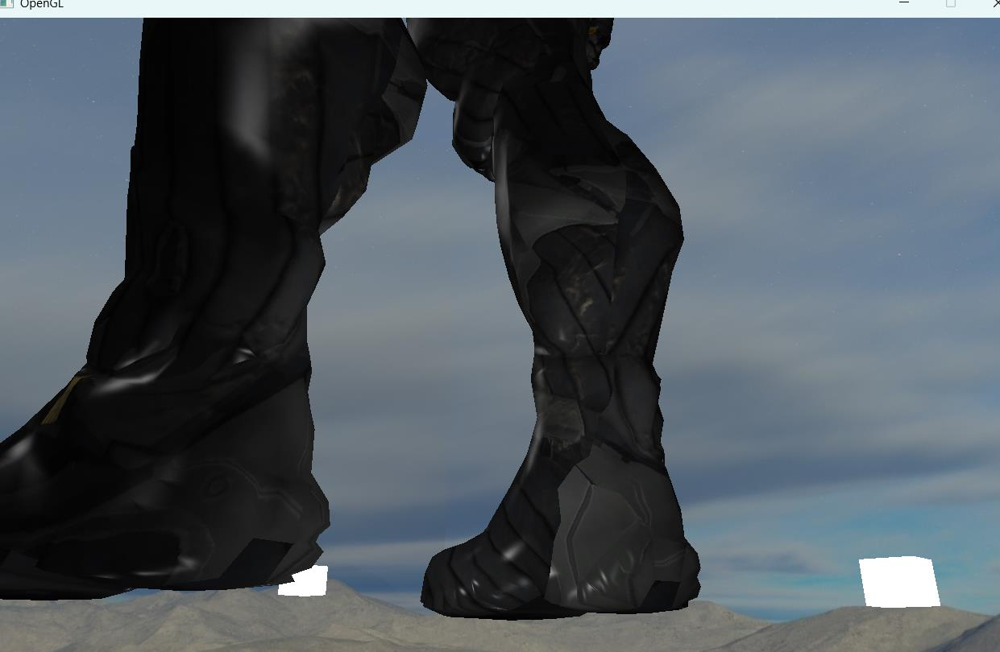
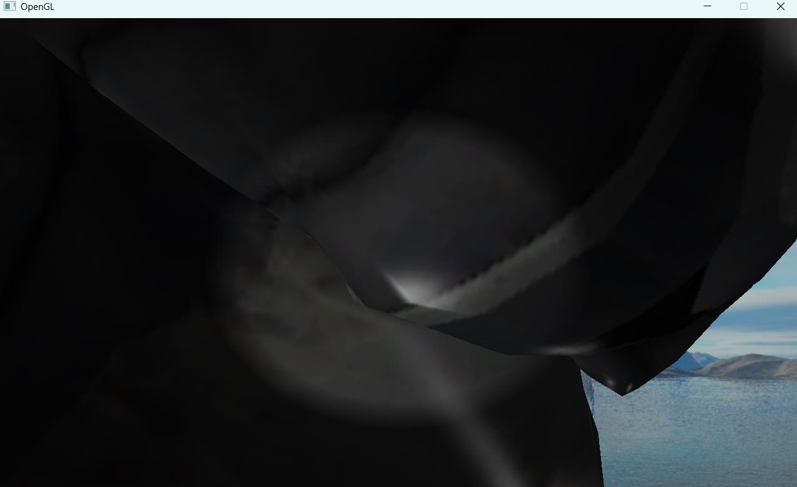
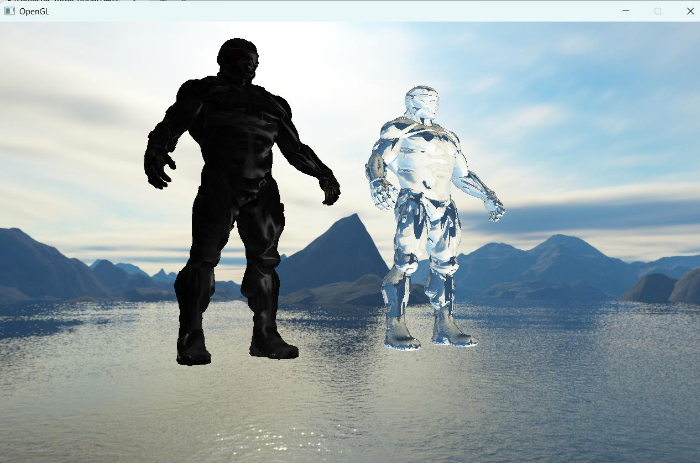

## Getting Started

```bash
git clone https://github.com/wordqiong/OpenGL_shader.git
cd Glitter
mkdir build
cd build
```

Now generate a project file or makefile for your platform. If you want to use a particular IDE, make sure it is installed; don't forget to set the Start-Up Project in Visual Studio or the Target in Xcode.

```bash
# UNIX Makefile
cmake ..

# Mac OSX
cmake -G "Xcode" ..

# Microsoft Windows
cmake -G "Visual Studio 17" ..
cmake -G "Visual Studio 17 Win64" ..
...
```

note:Visual Studio 17 ,it may cause error,17or either,it depends on your vs version,my vs version is 2022,so cmake -G "Visual Studio 17" .. can work well.

when you open sln,you need to set glitter as your start program(设置glitter为启动项目)

## perform

你可以看见点光源，聚光灯，天空盒，还有一个3D模型的两种渲染方式




